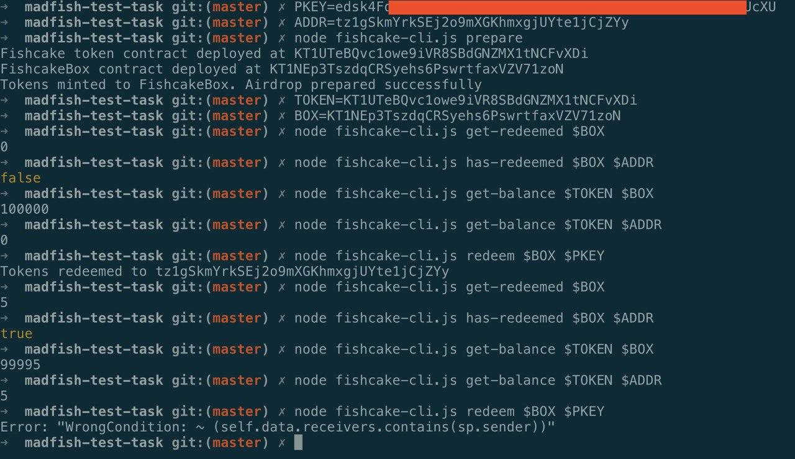

# tezos-airdrop-example



0. Install deps

```
$ npm install
```

1. Setup admin address and private key in `config.yaml`

2. Prepare token and airdrop contracts

```
$ node fishcake-cli.js prepare
```

3. Operate

```
# get amount of total redeemed tokens from the airdrop contract on the address <airdrop>
$ node fishcake-cli.js get-redeemed <airdrop>

# whether or not the <address> redeemed tokens from the airdrop contract on the address <address>
$ node fishcake-cli.js has-redeemed <airdrop> <address>

# get balance of tokens (of <token> contract) on the <address>
$ node fishcake-cli.js get-balance <token> <address>
```
